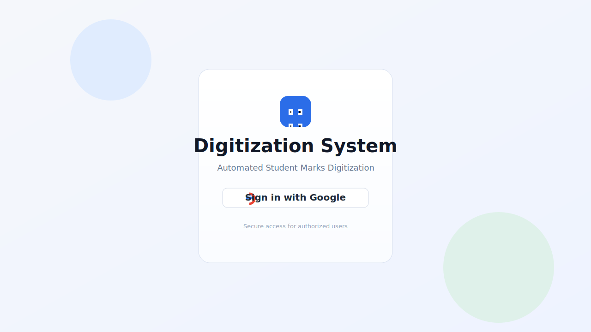
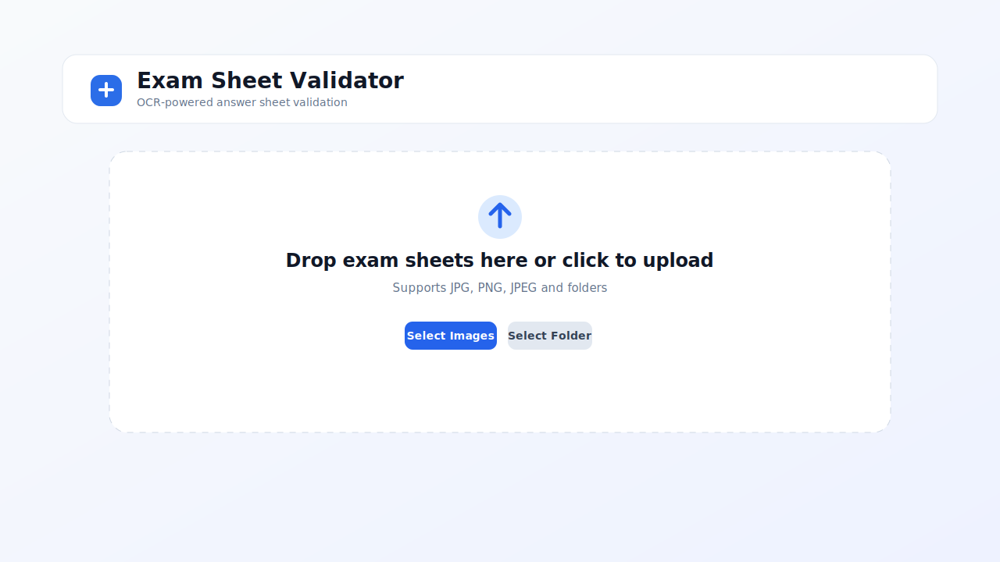
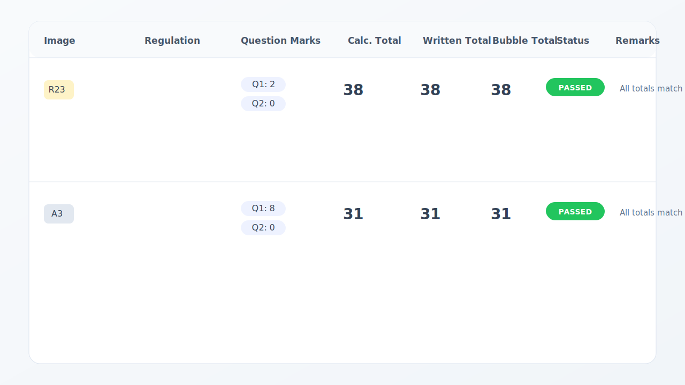

# Automation Student Mark Digitalization System

Automation Student Mark Digitalization System is a browser-based exam sheet validation system that uploads answer sheet images, runs OCR extraction, compares written totals against bubble totals, and exports the results to Excel.

## What it does

- Google sign-in for secure access
- Drag-and-drop or folder-based image upload
- OCR extraction through Supabase Edge Functions
- Automatic validation of question marks and totals
- Results table with per-sheet status and remarks
- Excel export for processed sheets

## Screenshots







## Tech Stack

- React 18
- Vite
- Tailwind CSS
- Radix UI
- Firebase Authentication
- Supabase Edge Functions
- EmailJS
- XLSX export

## Getting Started

### Prerequisites

- Node.js 18 or newer
- A package manager compatible with the lockfile in this repo

### Install

```bash
npm install
```

### Run locally

```bash
npm run dev
```

### Build for production

```bash
npm run build
```

### Run tests

```bash
npm run test
```

## Environment Variables

Set the following values in `.env`:

- `VITE_SUPABASE_PROJECT_ID`
- `VITE_SUPABASE_PUBLISHABLE_KEY`
- `VITE_SUPABASE_URL`
- `VITE_FIREBASE_API_KEY`
- `VITE_FIREBASE_AUTH_DOMAIN`
- `VITE_FIREBASE_PROJECT_ID`
- `VITE_FIREBASE_STORAGE_BUCKET`
- `VITE_FIREBASE_MESSAGING_SENDER_ID`
- `VITE_FIREBASE_APP_ID`
- `VITE_FIREBASE_MEASUREMENT_ID`
- `VITE_EMAILJS_SERVICE_ID`
- `VITE_EMAILJS_TEMPLATE_ID`
- `VITE_EMAILJS_PUBLIC_KEY`

## Project Structure

- `src/pages/Index.jsx` main workflow for upload, processing, and results
- `src/components/` reusable UI components
- `src/contexts/AuthContext.jsx` authentication state
- `src/utils/validation.js` marks validation logic
- `src/utils/excelExport.js` Excel export helper
- `supabase/functions/ocr-extract/index.js` OCR extraction function

## Notes

- The image files in this README are simple SVG previews included in the repo so the documentation stays self-contained.
- Update the screenshots if the UI changes significantly.